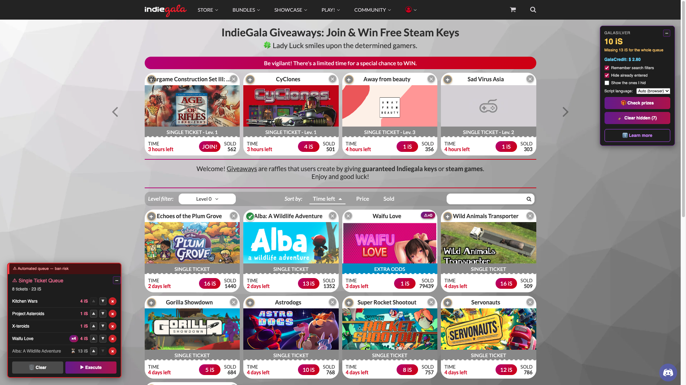
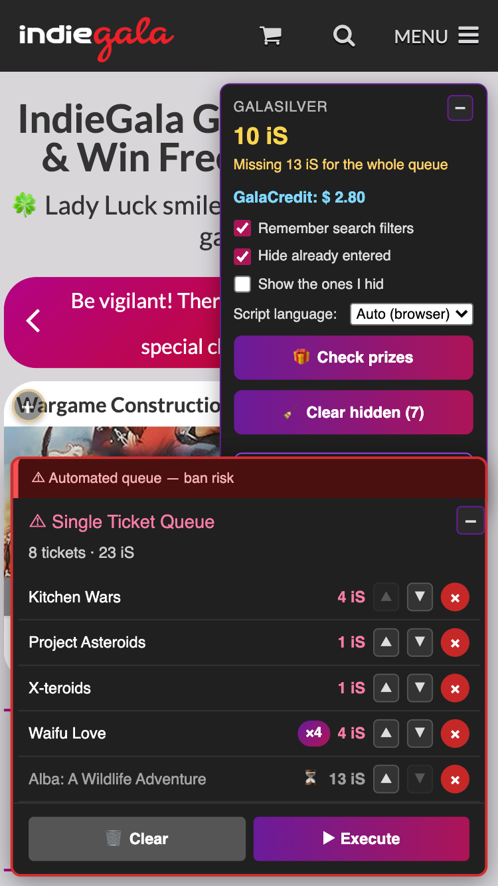
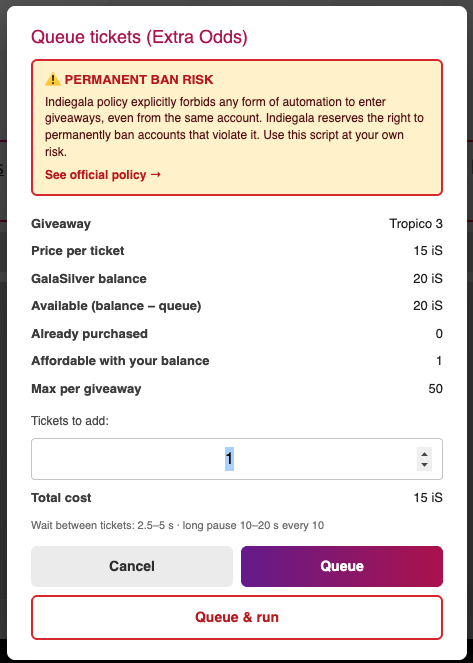
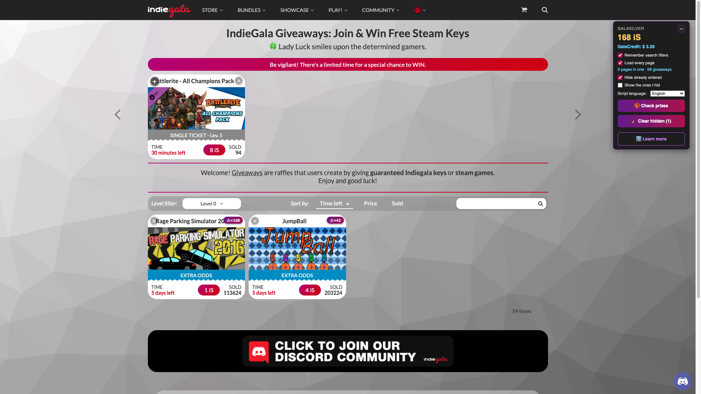
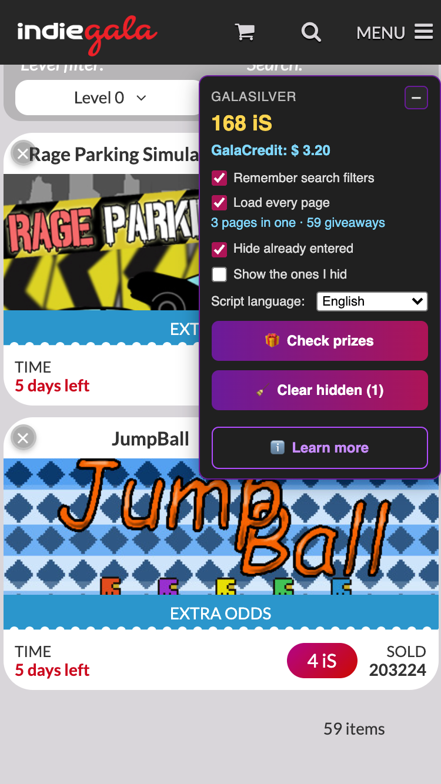

# Indiegala Bulk Tools

Tampermonkey userscript that adds a unified ticket-purchase queue and utilities to Indiegala giveaways, plus two lookup buttons on store product pages. / Userscript de Tampermonkey que añade una cola unificada de compra de boletos y utilidades a los giveaways de Indiegala, y dos botones de consulta en las fichas de la tienda.

> [!WARNING]
> **USE AT YOUR OWN RISK / USO BAJO TU PROPIO RIESGO:** automating purchases violates Indiegala's anti-spam policy and may cause a permanent ban. / Automatizar compras viola la política anti-spam de Indiegala y puede causar un baneo permanente.

***Queue panel** (bottom left): 16 tickets for 197 iS, one giveaway queued ×10, and a row dimmed with ⏳ — that one is short on GalaSilver, so the run skips it and buys it later instead of stopping. Every row keeps its ▲▼, and the order of the list is the order of execution, mid-run included. **GalaSilver widget** (top right): balance, what the whole queue is missing, GalaCredit, and the wheel countdown on your own clock. On each card: ＋ to queue a Single Ticket, ✕ in the opposite corner to hide that giveaway until it ends, ✓ for the ones already queued, and ⚠×N on Extra Odds cards, where N is how many tickets your balance covers. / **Panel de la cola** (abajo a la izquierda): 16 boletos por 197 iS, un giveaway encolado ×10, y una fila atenuada con ⏳ — a esa le falta GalaSilver, así que la corrida la salta y la compra luego en vez de pararse. Cada fila conserva sus ▲▼, y el orden de la lista es el orden de ejecución, también a mitad de corrida. **Widget de GalaSilver** (arriba a la derecha): saldo, cuánto le falta a la cola entera, GalaCredit, y la cuenta atrás de la ruleta en tu reloj. En cada tarjeta: ＋ para encolar un Single Ticket, ✕ en la esquina opuesta para ocultar ese giveaway hasta que termine, ✓ en los que ya están en cola, y ⚠×N en las de Extra Odds, donde N es cuántos boletos cubre tu saldo.*

*Same queue on a phone: the panel goes full width along the bottom, the widget clears the site header with its options and the wheel countdown readable at that width, and every row keeps its ▲▼ reorder controls, its ×N count and the ⏳ of the ones waiting for balance. / La misma cola en un móvil: el panel pasa a ancho completo abajo, el widget se aparta del header del sitio con sus opciones y la cuenta atrás de la ruleta legibles a ese ancho, y cada fila conserva sus controles ▲▼ para reordenar, su cuenta ×N y el ⏳ de las que esperan saldo.*

*Queueing **several tickets of the same giveaway** (Extra Odds). It opens from the ⚠×N badge on the card, and before you commit it lays out the figures the decision depends on: price per ticket, balance, what is left after the queue —negative here, and it says so— what you already have queued for this one, how many you can afford right now, and the 50-per-giveaway cap. Two separate exits, and they are not the same button: **Queue** leaves them waiting, **Queue & run** starts buying. The risky one is the outlined button, not the one the eye lands on. And you can queue beyond your balance on purpose: those tickets wait with ⏳ until you have GalaSilver. / Encolar **varios boletos del mismo giveaway** (Extra Odds). Se abre desde el badge ⚠×N de la tarjeta, y antes de comprometerte pone delante las cifras de las que depende la decisión: precio por boleto, saldo, lo que queda descontando la cola —aquí en negativo, y lo dice—, lo que ya tienes encolado de ese mismo, cuántos te alcanzan ahora mismo, y el tope de 50 por giveaway. Dos salidas distintas, y no son el mismo botón: **Encolar** los deja esperando, **Encolar y ejecutar** empieza a comprar. La arriesgada es la del borde, no la que se lleva la vista. Y puedes encolar por encima de tu saldo a propósito: esos boletos esperan con ⏳ hasta que tengas GalaSilver.*

*"Load every page" ticked: the three pages of the Level 0 listing are in this one, the widget says so right under the checkbox ("3 pages in one · 51 giveaways") and the pagination numbers have folded away at the foot, leaving the site's own total ("51 items") — that one is a fact, and it is still true. Every card keeps its ＋ and its ✕, fetched rows and native ones alike. / "Cargar todas las páginas" marcada: las tres páginas del listado de nivel 0 están en esta, el widget lo dice justo debajo de la casilla ("3 pages in one · 51 giveaways") y los números de la paginación se han plegado al pie, dejando el total del propio sitio ("51 items") — ese es un hecho, y sigue siendo verdad. Cada tarjeta conserva su ＋ y su ✕, las traídas igual que las nativas.*

*The same on a phone: the status line fits under its own checkbox, and at the foot of the listing the folded pagination leaves the site's total on its own. / Lo mismo en un móvil: la línea de estado cabe bajo su propia casilla, y al pie del listado la paginación plegada deja solo el total del sitio.*

*Store product page: GG.deals and PCGamingWiki close the price box, right under Add to Cart, in each brand's colour so they do not pass for another button of the store. Games, DLC and packs all get the same pair. / Ficha de la tienda: GG.deals y PCGamingWiki cierran la caja de precio, justo debajo de Add to Cart, con el color de cada marca para que no se confundan con otro botón de la tienda. Juegos, DLC y packs llevan el mismo par.*

## English

### What it does

**Ticket queue**
- **Unified queue** mixing "Single Ticket" (1 ticket) and "Extra Odds" (N tickets of the same giveaway), bought one after another.
- **Add, remove and reorder** while the queue runs. The order of the list *is* the execution order, so ▲▼ change what gets bought next even mid-run.
- **Queue beyond your balance.** Tickets you cannot afford are flagged with ⏳, skipped during the run and bought once you have GalaSilver — a run no longer dies on the first item you cannot pay for.
- **Extra Odds:** the ⚠×N badge on the listing card — where N is how many tickets your balance covers — asks how many tickets and gives you two exits: **Queue** (park them) or **Queue & run**. Capped at 50 tickets per giveaway. It also shows **how many tickets you already hold** in that giveaway, read from the giveaway's own page because the listing does not publish it (its «sold» is everyone's total, not yours). If it cannot be read, the line is left out rather than showing a zero.
- **Humanized pacing:** 2.5–5 s between tickets and a 10–20 s pause every 10, on a **Web Worker timer** so those pauses are not stretched when the tab sits in the background.
- Stops on its own when the server pushes back (rate limit, ban, no answer) and offers **Continue** when the cause is recoverable. The queue survives reloads.
- Clicking a card **title** queues it instead of opening the giveaway, so a stray click does not navigate away.
- The panel lives on the `/giveaways` listing: it hides on other pages but the queue is kept. Panel and widget can both be minimized, and they remember.

**GalaSilver widget**
- Live balance, read from Indiegala's own responses, plus what is left after the queue — or how much you are **missing** for all of it.
- Shows your GalaCredit as well. Minimizable, and it remembers.
- **Warns you at the 240 iS cap.** That is the most you can hold at once, so sitting there is accrual thrown away; the tooltip spells out the rate Indiegala documents (10 iS per hour, 240 a day).

**Prizes (your library)**
- **Check prizes** opens your library in a new tab and walks it for you: Giveaways → Completed to check → Check all → Completed won. If there is nothing to check it says so and goes on to the won list anyway.
- Announces prizes that ended **today** in its own in-page widget with links, plus a beep and a tab-title badge — once per prize, remembered so it never nags twice.

**Wheel of Fortune**
- Watches the wheel entry in the user menu and **reloads the page every 15 minutes**, which is what keeps three things current that Indiegala does not refresh on its own: your **balance** (GalaSilver and GalaCredit are read from the menu the server renders on load), **new giveaways** in the listing, and the wheel state — it never reloads while the queue is running or a dialog is open. When the wheel shows up it tells you three ways at once: a **🎡 mark at the start of the tab title** — the only part you can read from another tab —, a toast that stays until you dismiss it, and a **dialog you have to close**. The mark goes away once you spin. The dialog interrupts on purpose, and it is what reaches a tab you left open and forgot: a sound cannot: browsers refuse to let a *page* play audio until you have interacted with it in that page load, and there is no way around that from inside the page. Closing the dialog reloads the page, which is what brings up the popup you spin with. The widget also **counts down to the next wheel** on your own clock, switching to «available now» when there is one — the hour is an assumption (00:00 UTC, when the site's day starts), because Indiegala states it nowhere, and the script logs the window in which it sees the wheel appear so the assumption can be checked.
- After a spin it reads the prize, tells you which one, and reloads **when you close the popup** — not on a timer — so your balance and the menu are up to date without cutting your reading short. It never reloads while the queue is running or a dialog is open.

**Listing options**
- **Remember search filters:** sort, level filter, search text and page, re-applied on load.
- **Load every page:** pulls the rest of the listing's pages into the one you are on, keeping the sort order and level filter you have set. The cards arrive whole, so the queue, the **⚠×N** badge and the **✕** work the same on them. While the box is ticked it happens on its own on every page load — one request per page, spaced out, to Indiegala with your existing session, exactly the request its pagination makes when you click it — and it fetches nothing while there is a wheel to spin, while the queue is running, or over search results (Indiegala already returns all of those in a single response). Once everything is in, the pagination numbers fold away and the total ("132 items") stays — if the load stopped halfway they stay put, which is exactly when they are useful. While it is ticked, "Remember search filters" stops re-applying the saved page: with everything loaded it means nothing.
- **Hide giveaways you already entered** (remembered across reloads).
- **Hide a giveaway by hand:** the **✕** on each card (opposite corner to that card's own control) hides it, in your browser only. **"Show the ones I hid"** brings them back dimmed so you can restore one with **↺**, and **"Clear hidden (N)"** empties the whole list.
- **The hidden list cleans itself up.** Each entry drops off when its giveaway ends — worked out from the card's own "N days left" — so you never have to empty it by hand to keep it from growing.
- **Script language:** Spanish, English or Auto.
- **"Learn more"** button with a summary inside the page.
- Layout adapted to phones.

**Store pages** (`/store/game/*`, `/store/product/*` — games, DLC and packs alike)
- **[GG.deals](https://gg.deals/)** — where else that game is on sale, and for how much. It searches the **catalogue** by title (`/games/`), the same target the Humble Bundle script uses, so you land on the game's own page with its history and every offer.
- **[PCGamingWiki](https://www.pcgamingwiki.com/)** — compatibility, fixes, ultrawide and frame-rate notes. It searches without the edition suffix and, on a DLC, by the base game the page itself declares — the wiki documents DLC inside the game and has no page of its own for them.
- **Both are name searches, so they can miss**, and each says exactly that in its tooltip.
- **Every tooltip the script draws is its own**, not the browser's little grey box: same palette as the widgets, wide enough for the long ones and readable over the page. It covers the GalaSilver widget, the queue panel and these two buttons — Indiegala has no tooltip of its own to borrow, and these are the script's own controls. The browser tooltip stays underneath as the fallback, so nothing is lost if it cannot be drawn.
- **No DRM filter, on purpose.** Steam, GOG, Epic and Microsoft Store are single-DRM shops, so their scripts can pin GG.deals' DRM filter and always be right. IndieGala resells keys for several stores *and* sells DRM-free games, so there is no filter that is correct for the whole store — and the catalogue search ignores that parameter anyway.
- **The title comes from the page's own purchase button**, the cleanest source: the `<h1>` drags the delivery suffix along (`DOOM VFR *Steam Key*`) and sometimes the destination store in brackets (`Sid Meier's Civilization VI (Epic)`), and neither belongs in a search. Accents are dropped for GG.deals, which transliterates in its index, and kept for PCGamingWiki.
- Nothing else from this script runs on the store: no queue, no automation, no warnings. Just two links under *Add to Cart*.

**Language:** automatic Spanish / English detection (with manual override).

**Install:**
1. Install [Tampermonkey](https://www.tampermonkey.net/).
2. Open the installer: [indiegala-bulk-join.user.js](https://github.com/g31w0fw0rld/indiegala-bulk-join/raw/main/indiegala-bulk-join.user.js) (also on [GreasyFork](https://greasyfork.org/es-419/users/1590477-g31w) and [OpenUserJS](https://openuserjs.org/users/g31w0fw0rldgmail.com/scripts)).

**Sites:** `indiegala.com/giveaways`, `indiegala.com/library`, `indiegala.com/store/game/*` and `indiegala.com/store/product/*`

## Español

### Qué hace

**Cola de boletos**
- **Cola unificada** que mezcla "Single Ticket" (1 boleto) y "Extra Odds" (N boletos del mismo giveaway), comprados uno tras otro.
- **Añadir, quitar y reordenar** mientras la cola corre. El orden de la lista *es* el orden de ejecución, así que los ▲▼ cambian qué se compra a continuación incluso a mitad de corrida.
- **Encolar aunque no te alcance el saldo.** Los boletos que no puedes pagar se marcan con ⏳, se saltan durante la corrida y se compran cuando tengas GalaSilver — una corrida ya no muere en el primer ítem que no alcanza.
- **Extra Odds:** el badge ⚠×N en la tarjeta del listado —donde N es cuántos boletos cubre tu saldo— pregunta cuántos boletos y da dos salidas: **Encolar** (dejarlos esperando) o **Encolar y ejecutar**. Topado a 50 boletos por giveaway. Enseña además **cuántos boletos ya tienes comprados** de ese giveaway, leídos de su propia página porque el listado no lo publica (su «sold» es el total de todo el mundo, no el tuyo). Si no se puede leer, la línea no sale, en vez de enseñar un cero.
- **Ritmo humanizado:** 2.5–5 s entre boletos y una pausa de 10–20 s cada 10, sobre un **temporizador en Web Worker** para que esas pausas no se estiren con la pestaña en segundo plano.
- Se detiene solo cuando el servidor protesta (límite de ritmo, baneo, sin respuesta) y ofrece **Continuar** si la causa es recuperable. La cola sobrevive a las recargas.
- Al hacer clic en el **título** de una tarjeta se encola en vez de abrir el giveaway, para que un clic despistado no te saque de la página.
- El panel vive en el listado de `/giveaways`: se oculta en otras páginas pero la cola se conserva. Panel y widget se pueden minimizar, y lo recuerdan.

**Widget de GalaSilver**
- Saldo en vivo, leído de las propias respuestas de Indiegala, más lo que queda descontando la cola — o cuánto te **falta** para toda ella.
- Muestra también tu GalaCredit. Minimizable, y lo recuerda.
- **Avisa al llegar al tope de 240 iS.** Es lo máximo que puedes tener a la vez, así que quedarse ahí es acumulación tirada; el tooltip detalla el ritmo que documenta Indiegala (10 iS por hora, 240 al día).

**Premios (tu biblioteca)**
- **Revisar premios** abre tu biblioteca en otra pestaña y la recorre por ti: Giveaways → Completed to check → Check all → Completed won. Si no hay nada por revisar lo dice y pasa igualmente a la lista de ganados.
- Anuncia los premios terminados **hoy** en su propio widget dentro de la página, con enlaces, un beep y un contador en el título de la pestaña — una sola vez por premio, recordado para no repetirse.

**Wheel of Fortune**
- Vigila la entrada de la ruleta en el menú de usuario y **recarga la página cada 15 minutos**, que es lo que mantiene al día tres cosas que Indiegala no refresca solas: tu **saldo** (GalaSilver y GalaCredit se leen del menú que el servidor pinta al cargar), los **sorteos nuevos** del listado, y el estado de la ruleta —nunca recarga con la cola corriendo ni con un diálogo abierto—. Cuando aparece la ruleta, te avisa por tres vías a la vez: una **marca 🎡 al principio del título de la pestaña** —lo único que se lee desde otra pestaña—, un toast que se queda hasta que lo cierres, y un **diálogo que hay que cerrar**. La marca se va al girar. El diálogo interrumpe a propósito, y es lo que alcanza a una pestaña que dejaste abierta y olvidada: un sonido no puede — los navegadores no dejan sonar a una *página* hasta que hayas interactuado con ella en esa carga, y eso no tiene vuelta desde dentro. Al cerrar el diálogo la página se recarga, que es lo que trae el popup con el que girar. El widget lleva además la **cuenta atrás de la próxima ruleta** en tu reloj, y pasa a «disponible ahora» cuando la hay —la hora es una suposición (00:00 UTC, el arranque del día del sitio), porque Indiegala no la publica en ninguna parte, y el script apunta en la consola la ventana en la que la ve aparecer para poder comprobarla—.
- Tras un giro lee el premio, te dice cuál es, y recarga **al cerrar tú el popup** —no por temporizador— para que el saldo y el menú queden al día sin cortarte la lectura. Nunca recarga con la cola corriendo ni con un diálogo abierto.

**Opciones del listado**
- **Recordar filtros de búsqueda:** orden, filtro de nivel, texto y página, reaplicados al cargar.
- **Cargar todas las páginas:** trae a la que estás viendo el resto de las páginas del listado, con el orden y el filtro de nivel que tengas puestos. Las tarjetas llegan enteras, así que la cola, el badge **⚠×N** y la **✕** funcionan igual en ellas. Con la casilla puesta se hace solo en cada carga de la página —una petición por página, con pausa, a Indiegala y con tu sesión de siempre, exactamente la petición que hace su paginación al pulsarla— y no pide nada mientras haya ruleta por girar, mientras corra la cola, ni sobre resultados de búsqueda (esos Indiegala ya los devuelve todos en una sola respuesta). Cuando ya está todo dentro, los números de la paginación se pliegan y el total ("132 items") se queda —si la carga se paró a medias siguen ahí, que es justo cuando sirven—. Mientras está marcada, "Recordar filtros de búsqueda" deja de reaplicar la página guardada: con todas cargadas no significa nada.
- **Ocultar los giveaways en los que ya tienes boleto** (se recuerda al recargar).
- **Ocultar un giveaway a mano:** la **✕** de cada tarjeta (en la esquina opuesta al control propio de esa tarjeta) lo oculta, solo en tu navegador. **"Mostrar ocultos por mí"** los devuelve atenuados para restaurar uno con **↺**, y **"Limpiar ocultos (N)"** vacía la lista entera.
- **La lista de ocultos se limpia sola.** Cada oculto se va cuando termina su giveaway —calculado con el "N days left" de la propia tarjeta—, así que no hace falta vaciarla a mano para que no engorde.
- **Idioma del script:** español, inglés o Auto.
- Botón **"Saber más"** con un resumen dentro de la página.
- Layout adaptado a móviles.

**Fichas de la tienda** (`/store/game/*`, `/store/product/*` — juegos, DLC y packs por igual)
- **[GG.deals](https://gg.deals/)** —en qué otras tiendas está de oferta ese juego, y a cuánto—. Busca por título en el **catálogo** (`/games/`), el mismo destino que usa el script de Humble Bundle, así que caes en la ficha del juego con su histórico y todas sus ofertas.
- **[PCGamingWiki](https://www.pcgamingwiki.com/)** —compatibilidad, arreglos, ultrapanorámico y notas de frame rate—. Busca sin el sufijo de edición y, en un DLC, por el juego base que la propia ficha declara: la wiki documenta los DLC dentro del juego y no tiene página propia para ellos.
- **Los dos buscan por nombre, así que pueden no acertar**, y cada uno lo dice tal cual en su tooltip.
- **Todos los tooltips que dibuja el script son suyos**, no la cajita gris del navegador: la paleta de los widgets, ancho suficiente para los largos y legibles sobre la página. Cubre el widget de GalaSilver, el panel de la cola y estos dos botones —Indiegala no tiene tooltip propio que tomar prestado, y estos controles son del script—. El del navegador se queda debajo como respaldo, así que no se pierde nada si no se pudiera dibujar.
- **Sin filtro de DRM, a propósito.** Steam, GOG, Epic y Microsoft Store son tiendas de un solo DRM, así que sus scripts pueden fijar el filtro de GG.deals y acertar siempre. IndieGala revende llaves de varias tiendas *y* vende juegos sin DRM, así que no hay un filtro correcto para toda la tienda —y la búsqueda del catálogo ignora ese parámetro de todas formas—.
- **El título sale del propio botón de compra de la página**, que es la fuente más limpia: el `<h1>` arrastra el sufijo de entrega (`DOOM VFR *Steam Key*`) y a veces la tienda de destino entre paréntesis (`Sid Meier's Civilization VI (Epic)`), y ninguna de las dos cosas pinta nada en una búsqueda. Los acentos se quitan para GG.deals, que translitera en su índice, y se conservan para PCGamingWiki.
- En la tienda no corre nada más del script: ni cola, ni automatización, ni advertencias. Solo dos enlaces bajo *Add to Cart*.

**Idioma:** detección automática español / inglés (con override manual).

**Instalación:**
1. Instala [Tampermonkey](https://www.tampermonkey.net/).
2. Abre el instalador: [indiegala-bulk-join.user.js](https://github.com/g31w0fw0rld/indiegala-bulk-join/raw/main/indiegala-bulk-join.user.js) (también en [GreasyFork](https://greasyfork.org/es-419/users/1590477-g31w) y [OpenUserJS](https://openuserjs.org/users/g31w0fw0rldgmail.com/scripts)).

**Sitios:** `indiegala.com/giveaways`, `indiegala.com/library`, `indiegala.com/store/game/*` e `indiegala.com/store/product/*`

## Privacy / Privacidad

**EN:** the script makes almost no requests of its own — it automates clicks on the site's own buttons, so the requests that go out are Indiegala's with your existing session, and the library button just opens `indiegala.com/library` in a new tab. Three exceptions, all listed here rather than buried: **"Load every page"**, if you tick it, asks `indiegala.com` for the listing's remaining pages — one GET per page, spaced out, with your existing session, exactly the request its pagination makes when you click it; and the GG.deals favicon on store product pages, so that site sees a plain image request when the buttons are drawn — nothing about which game you are looking at (the PCGamingWiki logo is inline SVG and requests nothing); and when you open the Extra Odds dialog, the page of **that one giveaway**, to read how many tickets you already hold — one request, to Indiegala with your session, the same thing clicking the card's title does. The GalaSilver balance and giveaway states are read from the page. It stores in your browser (`localStorage` on `indiegala.com` and the userscript manager's storage) only the pending queue, your settings and budget, the prizes it has already notified you about, and your language preference. Nothing is sent to third parties or to the author. Beyond privacy, keep the warning above in mind: automating violates Indiegala's anti-spam policy and synthetic clicks are detectable by the site.

**ES:** el script casi no hace peticiones propias: automatiza clics sobre los botones del propio sitio, así que las peticiones que salen son las de Indiegala con tu sesión de siempre, y el botón de biblioteca solo abre `indiegala.com/library` en otra pestaña. Hay tres excepciones, y van aquí en vez de escondidas: **"Cargar todas las páginas"**, si la marcas, pide a `indiegala.com` las páginas que faltan del listado —un GET por página, con pausa, con tu sesión de siempre, exactamente la petición que hace su paginación al pulsarla—; y el favicon de GG.deals en las fichas de la tienda, con lo que ese sitio ve una petición de imagen corriente al dibujarse los botones —nada sobre qué juego estás viendo— (el logo de PCGamingWiki es SVG en línea y no pide nada); y al abrir el diálogo de Extra Odds, la página de **ese** giveaway, para leer cuántos boletos ya tienes comprados —una petición, a Indiegala y con tu sesión, lo mismo que pulsar el título de la tarjeta—. El saldo GalaSilver y el estado de los giveaways se leen de la página. Guarda en tu navegador (`localStorage` de `indiegala.com` y el almacenamiento del gestor de userscripts) solo la cola pendiente, tus ajustes y presupuesto, los premios de los que ya te avisó y tu preferencia de idioma. No se envía nada a terceros ni al autor. Aparte de la privacidad, recuerda el aviso de arriba: automatizar viola la política anti-spam de Indiegala y los clics sintéticos son detectables por el sitio.

## Support / Apoyar

This is part of something I'm building to grow. If it helps you and you'd like to support it, you can tip me on **[Ko-fi](https://ko-fi.com/g31w0fw0rld)** —only if you want—; and if a cause needs it more than I do, help that one instead.

Esto es parte de algo que estoy construyendo para crecer. Si te sirve y quieres apoyar, puedes invitarme un café en **[Ko-fi](https://ko-fi.com/g31w0fw0rld)** —solo si quieres—; y si hay una causa que lo necesite más que yo, ayúdala a ella.

---
Author / Autor: **g31w0fw0rld** · License / Licencia: **MIT**
